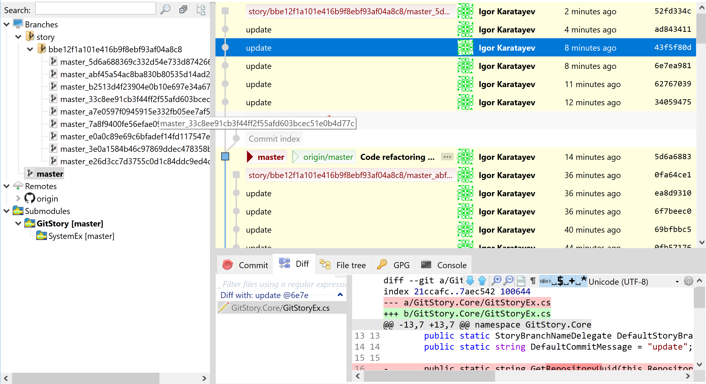
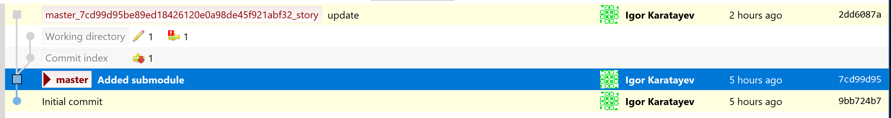
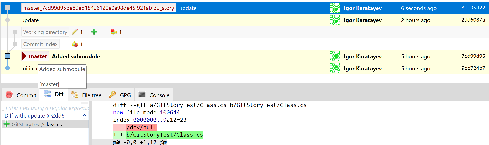

# GitStory
Git Story - save all your changes to git

The target of that project is to provide a way to track all your changes in git.
There are different styles of commiting - random commits, long commits, mini commits - every developer grow his own style; generally commits should be as small as possible, but that library promotes micro commits - save every your save to git. It produce a lot of commits even on a small reasonable commit - 10-15 commits, 5 minimum for even a small change in the IDE (definitely need a filter).

So my library consisting of a IDE extension (only VS17-19 now) commits every IDE save to separate branch parallel to the current. Usually commits consist of several files but some operations in the IDE makes micro saves.

So the picture looks like this:



Parallel to the current working branch there is a `refs/heads/story/{id}/{branch}_{sha}` branch with all micro-commits. The commit message is stupid, i was expecting git client showing time between commits but as commits age you have no luck restoring it visually. 

I find it interesting tool of getting back to context of any of my numerous projects, some of them abandoned on a midst of the moment of implementation; what happened long time ago need to be particularly thorough.

All this commits hold the information of your last coding actions on any project, task or fix, so you potentially restore the context of your mind process at any given point in the past and find the changes rejected by current task.




That is how branch is growing before and after commiting a save.

## Visual Studio extension

By installing Visual Studio extension you automatically enable it in any project using git. It will make save commits whenever last or all open documents are saved.

## CLI Tool

CLI tool GitStory can do the same an IDE extension is doing. Just simply run it in any folder of your project and it will do the trick.

You can also make a simple script like this:

```
#!/bin/sh
GitStory.exe $@
```

Name it `git-story` and put to path directory. That will add a `git story` command to git.

## Setup

Several repository config values can affect the behavior of that library.
* `gitstory.uuid` - UUID of the repository. It can be set by hand, or is automatically generated if none is set. It affects the `{id}` part of branch name template and helps to avoid collisions between story branches by different authors.
* `gitstory.commiter.name` - the name used in commiter signature for autogenerated commits. Default is "Git Story" if not set.
* `gitstory.commiter.email` - the email used in commiter signature for autogenerated commits. Default is `user.email` if not set.

## PS

Usually you don't need to push your story branches to the upstream, but you can. And that repository have story branches uploaded to show the idea how GitStory works.